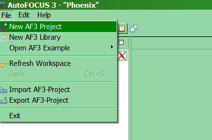

# af3
<h1>AutoFOCUS 3 traffic light example</h1> 
Nyissuk meg az autofocust 
Kattintsunk a File-> New AF3-Project-ra 

  

Majd hozzuk létre a projektünk legfontosabb részeit: követelmények, Komponsek és adatok 

A létrejött projekt részeket könnyedén átnevezhetjük, ha jobb egérrel kattintunk rájuk és a rename-re kattintunk. Legalábbis elméletben. Ez a követelmények résznél még működött, de a Component-Architecture-t sehogy sem engedte átnevezni, bármit is írtam be. 
Most foglalkozzunk a követelmények résszel, hozzáadunk az előbb is működő jobb gombos módszerrel egy Glossaryt, Requirement Sources-t és egy Requirements-et. 

Glossary Entry-k felvétele: 

Át is nevezhetőek 
Most töltsük meg a glossaryt tartalommal. 
Kitöltjük a Controller definíciját 

A Traffic entry definícióját is kitöltjük 

Ha minden igaz, akkor ezzel meg is vagyunk az entrykkel. 
Most adjuk meg a requirement sources-nál a követelmények forrásait 
A követelmények forrásai lehetnek: 
•	érdekelt felektől (stakeholders) 
•	külső rendszerekből (external system) 
•	dokumentumokból (document) 

Esetünkben három külső rendszer van: 
•	gyalogos lámpa(pedestrian light) 
•	kijelző(Indicator) 
•	közlekedési lámpa (traffic light) 
Az ISO 26262 szabvány adja a funkcionális követelményeinket, ezt document típussal vesszük fel. 
A general fülön el tudjuk nevezni és megadjuk a leírását 

A Files fülön akár csatolhatjuk is a dokumentumot, én most be fogom linkelni a szabványt: 

A leírását és a verzióját is megadhatjuk 

Mivel a szabvány három részben van fent a weben, ezért mindhárom linket megadjuk: 
A link utólag is szerkeszthető, viszont akkor írhatjuk újra a description és a version részt is, mert a program automatán  kitörli ezeket. 
Most következzenek az érdekelt felek: 
•	A gyalogosok(pedestrian) 
•	és a rendszer építői(System Architect) 
Stakeholder típussal hozom őket létre: 
Kitöltjük a definíció részeket. Szinonimákat is adhatunk meg egyes dolgokra, a gyalogosra adtunk is 

Ezzel megvannak a követelmények forrásai is 

A követelmények: 
Létrehozhatunk package-eket, hogy egységbe zárjunk egyes követelményeket. Megadhatunk use-case-eket is, amelyek felhasználói esetek 

Létre is hozunk két package-et, egyet a követelményeknek, egyet a use case-eknek: 

Először a Use Cases Package-ben dolgozzuk ki a use case-t 
A use case tulajdonságainak nagy része egyszerűen beírható Az actor felvitelét mutatja az alábbi kép: 

Észrevesszük, hogy Inputokat outputokat nem lehet még a modell nélkül ide beírni, ezekre még visszatérek. 
A use case-hez felvehetünk scenariokat is, ezek különféle lefutásai ugyanannak a use case-nek, itt definiálhatjuk, hogy mi egy hibás lefutás vagy egy sikeres. 
felvettem a Failure scenario-t a use case-ek között, itt adjuk meg, hogy mit kell tenni vészhelyzet esetén 

Készítek még egy use case-et „ Activate traffic light to 'red' and pedestrian light to 'go'” néven, ez sikeres scenario 

Actort véletlenül se próbáljunk meg dupla kattintással adni a use case-hez, az kiveszi az actorok listájából. 
A Branch részben meg tudjuk adni, hogy az adott jelenséget produkálja a rendszer, akkor az előző use case-ekből hova is ugorjon a végrehajtás. 

Menjünk tovább az előzőleg létrehozott MSC specification-re, eddig nem tudtuk átnevezni, de ha adunk hozzá MSC-ket erre is képesek leszünk 

Itt UML szekvencia diagramra hasonlító módon készíthetünk modellt. Itt ismét gondom akadt az inputok és outputok esztétikus elhelyezésével, mindegyik fordítva áll, mint ahogy akartam. 

Átmenetet úgy lehet behúzni, hogy nyomva tartjuk a Ctrl gombot, belekattintunk az egyik objektumba, majd húzzuk az egeret a másikhoz és végül elengedjük az egér gombját, eddigi észrevételem szerint teljesen véletlen, hogy melyik input/output melyik oldalra kerül, áthelyezni nem tudok őket.  
A többi követelmény felvétele 

Ezzel néhány apróságot eltekintve elkészültünk a követelményekkel, most térjünk át a Data dictionary-re. 
Adatszerkezetek és függvények hozzáadása (Data dictionary) 
A Data dictonary-be az oldalsó eszköztárról tudunk elemeket behúzni 

Nem is időzünk itt sokat, a Properties-ben lehet módosítani a függvények visszatérési értékét/paramétereit és minden egyebet. Figyelem a void kulcsszó itt nem használható. Csak visszatérési értékkel rendelkező, állapotváltozót nem módosító függvényeket hozhatunk létre. 

Elkészítjük a modellt, ügyelünk a konzisztens elnevezésekre, hogy tudjunk mindenre hivatkozni. 
Miután a modell elkészült a use case-hez köthetünk egyes modellelemeket, ezt a use case beállításai között tehetjük meg: 

