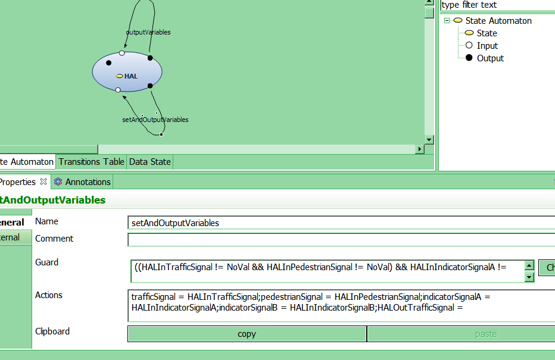

# autofocus3 használatának bemutatása a közelekedési lámpa példáján keresztül.
<h1 align="center">AutoFOCUS 3 traffic light example</h1> 
Nyissuk meg az autofocust 
Kattintsunk a File-> New AF3-Project-ra 

Majd hozzuk létre a projektünk legfontosabb részeit: követelmények, Komponsek és adatok 

A létrejött projekt részeket könnyedén átnevezhetjük, ha jobb egérrel kattintunk rájuk és a rename-re kattintunk. Legalábbis elméletben. Ez a követelmények résznél még működött, de a Component-Architecture-t sehogy sem engedte átnevezni, bármit is írtam be. 
<h2>Követelmények</h2> 
Most foglalkozzunk a követelmények résszel, hozzáadunk az előbb is működő jobb gombos módszerrel egy Glossaryt, Requirement Sources-t és egy Requirements-et. 

Glossary Entry-k felvétele: 

Át is nevezhetőek a létrehozott dolgok. 
Most töltsük meg a glossaryt tartalommal. 
Kitöltjük a Controller definíciját 

A Traffic entry definícióját is kitöltjük 

Ha minden igaz, akkor ezzel meg is vagyunk az entrykkel. 
Most adjuk meg a requirement sources-nál a követelmények forrásait 
A követelmények forrásai lehetnek: 
<ul>
    <li>érdekelt felektől (stakeholders)</li>
    <li>külső rendszerekből (external system)</li>
    <li>dokumentumokból (document)</li>
</ul>

Esetünkben három külső rendszer van: 
<ul>
    <li>gyalogos lámpa(pedestrian light)</li>
    <li>kijelző(Indicator)</li>
    <li>közlekedési lámpa (traffic light)</li>
</ul>
Az ISO 26262 szabvány adja a funkcionális követelményeinket, ezt document típussal vesszük fel. 
A general fülön el tudjuk nevezni és megadjuk a leírását 

A Files fülön akár csatolhatjuk is a dokumentumot, én most be fogom linkelni a szabványt: 

A leírását és a verzióját is megadhatjuk 

Mivel a szabvány három részben van fent a weben, ezért mindhárom linket megadjuk: 
A link utólag is szerkeszthető, viszont akkor írhatjuk újra a description és a version részt is, mert a program automatán  kitörli ezeket. 
Most következzenek az érdekelt felek: 
<ul>
    <li>A gyalogosok(pedestrian)</li>
    <li>és a rendszer építői(System Architect)</li>
</ul>
Stakeholder típussal hozom őket létre: 
Kitöltjük a definíció részeket. Szinonimákat is adhatunk meg egyes dolgokra, a gyalogosra adtunk is 

Ezzel megvannak a követelmények forrásai is 

A követelmények: 
Létrehozhatunk package-eket, hogy egységbe zárjunk egyes követelményeket. Megadhatunk use-case-eket is, amelyek felhasználói esetek 

Létre is hozunk két package-et, egyet a követelményeknek, egyet a use case-eknek: 

Először a Use Cases Package-ben dolgozzuk ki a use case-t 
A use case tulajdonságainak nagy része egyszerűen beírható Az actor felvitelét mutatja az alábbi kép: 

Észrevesszük, hogy Inputokat outputokat nem lehet még a modell nélkül ide beírni, ezekre még visszatérek. 
A use case-hez felvehetünk scenariokat is, ezek különféle lefutásai ugyanannak a use case-nek, itt definiálhatjuk, hogy mi egy hibás lefutás vagy egy sikeres. 
felvettem a Failure scenario-t a use case-ek között, itt adjuk meg, hogy mit kell tenni vészhelyzet esetén 

Készítek még egy use case-et „ Activate traffic light to 'red' and pedestrian light to 'go'” néven, ez sikeres scenario 

Actort véletlenül se próbáljunk meg dupla kattintással adni a use case-hez, az kiveszi az actorok listájából. 
A Branch részben meg tudjuk adni, hogy az adott jelenséget produkálja a rendszer, akkor az előző use case-ekből hova is ugorjon a végrehajtás. 

Menjünk tovább az előzőleg létrehozott MSC specification-re, eddig nem tudtuk átnevezni, de ha adunk hozzá MSC-ket erre is képesek leszünk 

Itt UML szekvencia diagramra hasonlító módon készíthetünk modellt. Itt ismét gondom akadt az inputok és outputok esztétikus elhelyezésével, mindegyik fordítva áll, mint ahogy akartam. 

Átmenetet úgy lehet behúzni, hogy nyomva tartjuk a Ctrl gombot, belekattintunk az egyik objektumba, majd húzzuk az egeret a másikhoz és végül elengedjük az egér gombját, eddigi észrevételem szerint teljesen véletlen, hogy melyik input/output melyik oldalra kerül, áthelyezni nem tudok őket.  
A többi követelmény felvétele 

Ezzel néhány apróságot eltekintve elkészültünk a követelményekkel, most térjünk át a Data dictionary-re. 
Adatszerkezetek és függvények hozzáadása (Data dictionary) 
A Data dictonary-be az oldalsó eszköztárról tudunk elemeket behúzni 

Nem is időzünk itt sokat, a Properties-ben lehet módosítani a függvények visszatérési értékét/paramétereit és minden egyebet. Figyelem a void kulcsszó itt nem használható. Csak visszatérési értékkel rendelkező, állapotváltozót nem módosító függvényeket hozhatunk létre. 

Elkészítjük a modellt, ügyelünk a konzisztens elnevezésekre, hogy tudjunk mindenre hivatkozni. 

<h2>A modell elkészítése</h2> 
Három komponensből építkezünk: 
<ul>
<li>Controller</li>
<li>Merge</li>
<li>Panel</li>
</ul>
Hozzuk ezeket létre a Component Architecture-ben, új komponensek hozzáadásával: 

A properties fülön ezek a komponensek átnevezhetőek, ahogy már a többi modellelemnél is megszokhattuk. 

Először elkészítjük a komponensek egymáshoz való viszonyát leíró legfelsőbb komponens diagramot. 
Inputok hozzáadása a modellhez az input karika diagramterületre való behúzásával történik: 

Az input properties menüjében be tudjuk állítani a típusát és megadhatjuk a nevét is. Típusokból azokat tudjuk használni, amelyeket megadtunk a Data dictionary-ban, vagy választhatunk az int, boolean, double primitív típusok közül. 

Ahhoz, hogy az inputból átmenetet húzzunk egy komponensbe, le kell nyomni a Ctrl billentyűt és az egér gombját nyomva tartva tudunk nyilat húzni. Ha nem tetszik az input elhelyezkedése a komponensen, akkor egyszerűen arrébb húzhatjuk fogd és vidd módszerrel: 

Az átmenetnek is tudunk nevet adni a properties részben:

Összeraktuk a legfelsőbb komponens diagramot, ne ijedjünk meg az alábbi hibaüzenetttől, az eszköznek igaza van, teddig tényleg gyengén kauzális rendszerünk van, de majd a végén visszatérünk erre: 

Csináljuk meg a komponensek belsejét is, a Merge komponensben egy állapotdiagram lesz. Húzzuk is be az eszköztárról: 

Az átmentek őrfeltételeiben hivatkozhatunk a ki és bemeneteinkre és használhatjuk a Data dictionary-ben definiált értékéket is egy-egy enumeration típushoz. Ezek furcsamód függvényhívásszerűen vannak jelölve, alább a Present( ) egy lehetséges értéke a Signal típusnak. 

A megfelelő átmenetek behúzása után a modell ezen részével nincs több dolgunk, specifikáltuk a Merge komponens működését: 

A Contoller komponensbe egy újabb komponenst teszünk Behavior néven, melynek a belsejében majd egy állapotgép lesz.
Elkészült a Behavior, még mindig megkapjuk ugyanazt a hibaüzenetet, ne foglalkozzunk vele: 

Húzzunk be az eszköztárról egy újabb state automaton-t a Behavioron belülre. Vegyük fel a közlekedési lámpánk állapotait: 
<ul>
    <li>Red</li>
    <li>Yellow</li>
    <li>RedYellow</li></li>
    <li>Green</li>
    <li>Init</li>
</ul>
Majd menjünk a Data State fülre

Itt belső változókat lehet a modellhez hozzáadni. Adjunk is hozzá egy idő(time) int változót az oldalsó Add gombbal: 

Váltsunk vissza State automaton nézetre, ott ahol a Data State fület választottuk és hozzuk létre a modellt. A time változóra innentől hivatkozhatunk őrfeltételekben és akciókban is. 

Ügyeljünk az eggyel felsőbb szint elnevezéseire, hogy valóban azokat használjuk-e, az én esetemben elfeledtem egy Outputot átnevezni a Behaviornál és most ezért ír hibát. Ügyeljünk a szóközökre is, ha mindent jól elneveztünk és csak arra hivatkozunk, ami valóban létezik, akkor nem kapunk ilyen hibákat. 

Ügyeljünk rá, hogy elsőre jó helyre kerüljenek a nyilak és rögtön esztétikus legyen a modell, mert a state automaton-nál hiába próbáljuk átpakolni az elcsúszott inputokat/outputokat a program kissé öntörvényűen értelmezi, hogy hova is tennénk ezeket: 

A program készítői az állapotgép kezdőállapotát +1 kimenetnek látszó karikával jelölték meg, amiből nem jön ki semmi és nem is megy be. 

Ezzel meg is van a sajnálatosan nem túl szép állapotgép. A ki/bemenetek és átmenete pozícionálásra még nem sikerült rájönni. 

A következő rész a Panel komponens, ez két külön komponensből fog állni: 
<ul>
    <li>A megjelenítő (Display)</li>
    <li>A HAL(Hardware Abstration Layer)</li>
</ul>
Először a komponensek egymáshoz való viszonyát modellezzük le. A hibaüzenetünk még mindig ugyanaz. 

A HAL belül egy újabb állapotgép lesz, amiben ismét belső változókra lesz szükségünk, amiket a Data State fülön definiálhatunk: 

Ha az eggyel feljebbi szinten mindent tisztességesen elneveztünk, akkor itt semmi hibát nem kaphatunk.
Csináljuk most meg a megjelenítésért felelős Display komponenst. Ennek a belsejében egy operator panel lesz. 

Helyezhetünk bele nyomógombot:

És címkéket is:

És persze lámpákat:

Végül kezdjünk valamit a hibaüzenettel, ami végig velünk volt modellezés közben:

A hibaüzenetre a megoldás annyi, hogy a Controller Behavior-jánál beállítjuk erősen kauzálisra rendszert és utána már nem szól, hogy gyengén kauzális.

Ezzel el is készült a modell. 
Miután a modell elkészült a use case-hez köthetünk egyes modellelemeket, ezt a use case beállításai között tehetjük meg: 

Ennek segítségével később ellenőrzhetjük, hogy a modellünk megfelel-e az előzetesen felállított követelményeknek.

<h2>A generátormodell</h2> 
Az eddigiekben bemutatott modell természetesen azért készült, hogy később ellenőrzött programkód legyen belőle. Ehhez nyújt segítséget nekünk a generátormodell. 
Először készítsünk egy új projektet. 

